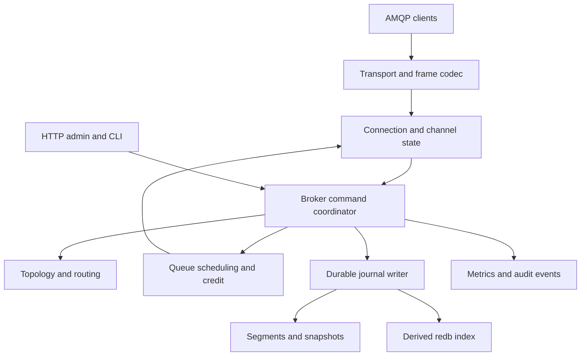

# rusty-mq — Product Requirements and AI Coding Agent Handoff

| Document field | Value |
| --- | --- |
| Product | **rusty-mq** |
| Version | **1.0 — implementation baseline** |
| Date | 2026-10-02 |
| Owner | Gavin Yang / rusty-mq |
| GitHub namespace | https://github.com/rusty-mq — supplied by the owner |
| Proposed main repository | `rusty-mq/rusty-mq` — a proposal, not a claim that the repository exists |
| Deliverable | PRD, technical requirements, development backlog, and acceptance contract |
| Implementation status | **Not implemented or validated by this document.** All acceptance tests are requirements. |
| Proposed license for original code | `MIT OR Apache-2.0`; preserve separate third-party notices |
| Initial deployment | One Linux host, one process, local persistent disk |
| Primary audience | AI coding agent, maintainer, reviewer, and early adopters |

## 1. Instructions for the coding agent

Build an independent Rust message broker named **rusty-mq**, supporting the explicitly defined AMQP 0-9-1 and RabbitMQ-extension subset in this document.

Read this entire document before implementation. Start with **M0**, then implement the milestones in dependency order. Maintain a requirement-to-test ledger as work proceeds. A feature is complete only when its acceptance evidence exists.

The product objective is:

> A compact, self-hosted Rust message broker that works with existing AMQP 0-9-1 client libraries for a tested set of durable work-queue, routing, and request/reply workloads.

The first production candidate must be a durable, single-node broker. An in-memory prototype is an internal development milestone, not a production release. There is no requirement to translate Erlang code or reproduce RabbitMQ's internal storage format.

### 1.1 Binding decisions

| Decision | Required direction |
| --- | --- |
| Protocol | AMQP 0-9-1 plus the named extensions below |
| Initial availability model | Single-node; no automatic failover |
| Durability | Persistent messages in durable queues; positive publisher confirms only after the required commit boundary |
| Delivery model | At-least-once under the conditions in §7; applications handle duplicates |
| Runtime | Tokio; bounded asynchronous work and dedicated blocking storage execution |
| Core | Rust libraries with explicit protocol, broker, and storage boundaries |
| Durable authority | One append-only, segmented journal for durable broker state |
| Embedded database | `redb` as a derived, rebuildable index/checkpoint accelerator |
| Management | Native HTTP API and CLI in V1; RabbitMQ HTTP API compatibility later |
| Distribution | One executable and container image; no external database requirement |
| Compatibility marketing | Publish a tested feature matrix; do not claim universal drop-in replacement |
| Performance marketing | Publish reproducible measurements; do not assume Rust guarantees a speedup |

Architecture changes are allowed when evidence supports them. Record an ADR and preserve the externally visible guarantees. Do not silently change requirements, disable failing tests, or reduce durability to reach throughput targets.

### 1.2 Requirement language

- **MUST**: V1 release requirement unless a different release is named.
- **SHOULD**: expected design; a documented, reviewed alternative is acceptable.
- **Deferred**: do not implement in the V1 critical path.
- **Target**: an engineering objective, not an achieved measurement or existing guarantee.

Unless explicitly marked otherwise, the functional requirements and mandatory operational requirements assigned to V1 are **P0**. Performance targets and deferred releases are tracked separately from correctness gates.

Prior informal suggestions are superseded by this baseline where they conflict. In particular, publisher confirms, virtual hosts, authentication, TLS, resource controls, recovery, and observability are V1 requirements. Clustering and feature-rich management are deferred.

## 2. Product rationale and users

### 2.1 Problem

Small application teams need reliable asynchronous work and event routing without operating a large platform. Existing AMQP client libraries are useful, but replacing a broker requires semantic compatibility, not just successful TCP connections.

rusty-mq will compete on predictable deployment, explicit behavior, inspectable implementation, and modest operational needs. Reduced resource use is a hypothesis to measure.

### 2.2 Initial users and jobs

| User | Job | Success condition |
| --- | --- | --- |
| Independent developer / small SaaS team | Run background jobs, notifications, and integrations | One persistent service; ordinary client libraries work for supported patterns |
| Application engineer | Use direct, fanout, and topic routing | Correct routing, bounded delivery, explicit failure feedback |
| Operator | Diagnose backlog and recover after restart | Useful metrics, health checks, offline backup, reproducible restore |
| Existing RabbitMQ user | Evaluate migration for a simple workload | Preflight report identifies blockers before traffic moves |
| Contributor / coding agent | Extend broker behavior safely | Documented invariants, independent conformance tests, manageable modules |

### 2.3 Supported example workloads

1. Durable background work with manual acknowledgements and publisher confirms.
2. Notifications fanned out into several ordinary queues.
3. Event routing by a dotted topic key.
4. Request/reply using a real temporary exclusive reply queue, `reply_to`, and `correlation_id`.
5. Development and integration environments using the same AMQP libraries as production.

Do not advertise framework-level compatibility with Celery, Spring AMQP, MassTransit, or other frameworks merely because their underlying client connects. Each framework profile needs its own configuration and tests; several depend on features outside V1.

### 2.4 Explicit non-goals for V1

- Full RabbitMQ replacement, Erlang compatibility, or loading RabbitMQ plugins.
- RabbitMQ data-directory compatibility or in-place conversion of its message files.
- Quorum queues, clustering, replication, leader election, or disaster recovery across hosts.
- AMQP 1.0, MQTT, STOMP, RabbitMQ Streams, Kafka protocol, or federation.
- Exactly-once delivery, broker-side application deduplication, or atomic business transactions.
- AMQP transactions, priority queue scheduling, TTL, dead lettering, delayed exchange, alternate exchange, or exchange-to-exchange bindings.
- Direct Reply-to (`amq.rabbitmq.reply-to`), single-active-consumer, or consumer priority.
- RabbitMQ policy engine, complete HTTP management API, web console, Kubernetes operator, or managed cloud service.
- Hot backups, shared-filesystem active/active, online format downgrade, or hot configuration reload.

## 3. Release boundaries and success criteria

| Release | Included | Exit condition |
| --- | --- | --- |
| Development alpha | Protocol, routing, consumer state machines, memory-backed tests | Correct core behavior in loopback/test environments; no production durability claim |
| Durability beta | Journal, recovery, confirms, checkpoints, resource controls | Failure-injection and restart suite passes |
| **V1.0 candidate** | Complete scoped broker, TLS/auth, native admin API, CLI, five-client suite, migration preflight, packaging | All P0 requirements and §17 release gates pass |
| V1.1 | TTL, DLX, explicit overflow behavior, selected RabbitMQ HTTP endpoints | Separately specified and tested semantics |
| V2 | Broader compatibility, priorities, optional console and additional operations | Driven by real blocked workloads |
| V3 | Replicated durable queues and cluster control plane | Independent distributed-correctness review and fault tests |
| Later research | Streams and additional protocols | New demand and separate specifications |

**V1 success is a narrow, demonstrated compatibility envelope.** There is no “80% compatible” target without a workload inventory and measured denominator.

## 4. Compatibility contract

### 4.1 Compatibility levels

| Level | V1 requirement |
| --- | --- |
| Wire | Correct AMQP framing, negotiation, channel behavior, and listed methods |
| Semantic | Correct routing, queue lifecycle, acknowledgements, confirms, durability, and error scope |
| Client | Tested versions of Python `pika`, Node.js `amqplib`, Java RabbitMQ client, Go `amqp091-go`, and Rust `lapin` |
| Operations | Native rusty-mq operations; no RabbitMQ HTTP compatibility claim |
| Persistence | rusty-mq's own versioned storage format only |
| High availability | Not provided by V1 |

“Change only the broker endpoint” may be claimed only for a tested application configuration that uses supported features and compatible credentials, virtual hosts, TLS settings, and topology. A source broker's durability or availability guarantees must also be considered.

### 4.2 Freeze a reference implementation before coding semantics

At M0, create `compatibility/baseline.yaml` with:

- Exact RabbitMQ release and immutable container image digest.
- Effective RabbitMQ configuration, queue type, and enabled deprecated features.
- Exact client-library versions, runtimes, operating system, and test-harness commit.
- AMQP specification source revision and codec dependency revision.
- Supported, rejected, and intentionally divergent cases.

The official documentation consulted for this PRD is served as RabbitMQ **4.3** documentation. A documentation version is not an immutable test baseline. Select an available supported RabbitMQ release, pin it, and record its behavior; never use `latest` as the sole reproducibility reference. [R1]

RabbitMQ's 4.3 queue documentation changes the default for transient non-exclusive queues. V1 therefore makes this an explicit profile switch rather than assuming all versions behave identically. [R4]

If the reference release cannot be obtained, proceed with spec-based work but mark differential tests **blocked**, not passed. Any conflict between this PRD and an observed baseline must be recorded with a reproducer before selecting an intentional deviation.

### 4.3 Capability advertisement

The AMQP server properties MUST identify `product=rusty-mq`, its actual version, and supported capabilities. Do not impersonate a RabbitMQ release number.

Advertise `publisher_confirms`, `basic.nack`, `consumer_cancel_notify`, and `connection.blocked` only after their paths are implemented and tested. Do not advertise unsupported extensions. Gate server-initiated extension messages on the client's declared capability where required. [R8][R9]

### 4.4 Unsupported features

Maintain `compatibility/features.yaml`, with one entry per feature:

```yaml
features:
  amqp_091:
    target_release: "1.0"
    status: planned
    requirement: FR-P01
    tests: []
  queue_ttl:
    target_release: "1.1"
    status: unsupported
    rejection: "channel.close 540 NOT_IMPLEMENTED"
    accepted_arguments: []
```

`planned` MUST NOT be displayed as `supported`. Generated documentation must derive support status from the implementation ledger and passing evidence.

Recognized unsupported behavior-bearing arguments MUST be rejected. Unknown queue, exchange, binding, and consumer arguments are rejected by default in V1; a future allowlist may accept demonstrably inert metadata. This is intentionally stricter than implementations that ignore unknown arguments.

Message application headers are opaque data, not topology arguments. Preserve them rather than rejecting arbitrary application keys.

## 5. Functional requirements: protocol and topology

### 5.1 Protocol and sessions

| ID | Requirement | Acceptance evidence |
| --- | --- | --- |
| FR-P01 | Accept AMQP 0-9-1 over TCP; reject other protocol headers cleanly | T01, T02 |
| FR-P02 | Implement `connection.start/start-ok`, `tune/tune-ok`, `open/open-ok`, and close handshake; SASL PLAIN initially | T01, T20 |
| FR-P03 | Implement channel open/close, per-channel state, independent channel errors, and channel ID validation | T02, T10 |
| FR-P04 | Negotiate and enforce `frame_max`, `channel_max`, and heartbeats | T02, T19 |
| FR-P05 | Decode method/header/body/heartbeat frames incrementally across arbitrary TCP chunk boundaries | T02, T26 |
| FR-P06 | Reassemble message bodies with byte budgets; validate frame terminators, classes, body lengths, table depth, and state transitions | T02, T26 |
| FR-P07 | Serialize all socket writes through one connection writer; preserve per-channel content ordering | T03, T26 |
| FR-P08 | Implement valid `nowait` behavior: suppress success replies only; still report errors | T03, T10 |
| FR-P09 | Cleanly close, time out, and reclaim connections, channels, deliveries, temporary queues, and reservations | T11, T19, T24 |

Protocol negotiation defaults proposed for V1:

- Maximum frame size: 131,072 bytes, including protocol framing; enforce protocol minimums and negotiation rules.
- Maximum channels per connection: 256, excluding channel 0.
- Heartbeat timeout proposal: 60 seconds; heartbeat negotiation and traffic accounting follow the documented algorithm. Test clients requesting zero and nonzero values. [R7]
- Handshake timeout: 10 seconds. Incomplete-message assembly timeout: 30 seconds.
- Message body cap: 16 MiB. Header/table budget: 64 KiB, also subject to frame size.
- Table/array nesting depth: 16. Field count cap: 1,024 per container.

These are rusty-mq defaults, not claims about RabbitMQ defaults. All limits must be validated before allocating from an untrusted size field. A protocol value of zero that means “unlimited” does not remove server resource protection.

### 5.2 Exchanges and routing

| ID | Requirement | Acceptance evidence |
| --- | --- | --- |
| FR-E01 | Default exchange `""`, plus predeclared `amq.direct`, `amq.fanout`, and `amq.topic` | T04 |
| FR-E02 | Declare/delete direct, fanout, and topic exchanges; passive declarations and property-equivalence checks | T04, T10 |
| FR-E03 | Preserve exchange durability and auto-delete lifecycle; enforce `internal=true` against direct publication | T04, T14 |
| FR-E04 | Bind/unbind queues; repeated equivalent bindings are idempotent | T04 |
| FR-E05 | Direct exact matching; fanout to bound queues; topic `*` and `#` semantics | T04, T27 |
| FR-E06 | One enqueue per destination queue for a single publish, even if several bindings match | T04, T27 |
| FR-E07 | Default-exchange routing resolves the routing key to the queue name inside the current vhost | T04, T21 |
| FR-E08 | Persist supported durable topology and remove obsolete bindings safely | T14, T15 |

For topics, `*` matches one dot-delimited word and `#` matches zero or more. The matcher must have bounded runtime; do not use uncontrolled recursive backtracking. Include empty keys, adjacent wildcards, Unicode, and repeated separators in differential tests. [R5]

Predeclared exchanges are protected from deletion. Do not permit application-created reserved `amq.` names except explicitly supported declarations of existing built-ins. Default-exchange implicit bindings cannot be manually modified.

Bindings survive restart only when both their exchange and destination queue survive. Do not resurrect transient exchanges or bindings from a persisted message's original envelope. Persistent messages already admitted to a durable queue survive independently of the later existence of their source exchange.

An auto-delete exchange becomes eligible for deletion only after it has had a binding and later loses its final binding. Persist the lifecycle facts needed to recover durable exchanges. Exchange-to-exchange binding remains unsupported; an internal exchange can exist but cannot receive ordinary direct client publications.

### 5.3 Queue profiles and lifecycle

| Queue profile | Durable | Exclusive | Auto-delete | V1 behavior |
| --- | --- | --- | --- | --- |
| Durable work queue | true | false | false | Required and recommended for durable workloads |
| Connection-owned temporary queue | false | true | either | Required; deleted when the owning connection ends |
| Shared transient queue | false | false | either | Optional compatibility profile, disabled by default |
| Durable auto-delete queue | true | false | true | Rejected in V1; scoped deviation |
| Durable exclusive queue | true | true | either | Rejected in V1; scoped deviation |

The narrower profile set avoids pretending to implement lifecycle combinations that have not been specified and tested.

| ID | Requirement | Acceptance evidence |
| --- | --- | --- |
| FR-Q01 | Declare/passively inspect queues and return queue name, ready count, and consumer count | T05 |
| FR-Q02 | Generate unique names when requested and remember the last declared queue for methods using the empty-name shorthand | T05, T25 |
| FR-Q03 | Equivalent redeclaration succeeds; conflicting supported properties close the channel with `406 PRECONDITION_FAILED` | T05, T10 |
| FR-Q04 | Enforce connection ownership of exclusive queues; queue exclusivity does not prevent another authorized connection publishing through an exchange | T05, T21 |
| FR-Q05 | Auto-delete temporary queues after the last consumer disappears only if the queue has had a consumer | T05, T11 |
| FR-Q06 | Implement `queue.delete` with `if_unused`/`if_empty`, and `queue.purge` for ready messages only | T05, T16 |
| FR-Q07 | Support absent `x-queue-type` and explicit `classic` as the single-node queue profile | T05, T22 |
| FR-Q08 | Reject quorum/stream types and unsupported queue arguments before creation | T22 |
| FR-Q09 | Emit negotiated consumer-cancel notifications on deletion and perform idempotent cleanup | T11 |

Queue names are AMQP short strings. Use opaque internal IDs for files and durable references; never turn a user queue name into a filesystem path.

`classic` here denotes the supported wire-level queue profile. It does not imply RabbitMQ's storage engine or full classic-queue feature parity. Durability, exclusivity, auto-delete, server-generated names, and declaration equivalence must be tested independently. [R4]

**Deletion rules:** use the pinned reference for the exact `if_empty` interpretation, and include both ready and unacknowledged scenarios in fixtures. Purge MUST NOT erase unacknowledged deliveries. Once a delete succeeds, late acknowledgements must not recreate the old queue or mutate a new queue with the same name. Retain delivery tombstones as necessary until channel cleanup.

### 5.4 Messages and properties

| ID | Requirement | Acceptance evidence |
| --- | --- | --- |
| FR-M01 | Accept arbitrary binary bodies, including zero bytes and zero-length messages | T06 |
| FR-M02 | Preserve supported Basic properties and typed application headers through routing, storage, recovery, and return | T06, T14 |
| FR-M03 | Interpret absent delivery mode as transient; modes 1 and 2 are supported; reject invalid values explicitly | T06, T14 |
| FR-M04 | Validate a supplied `user_id` against the authenticated principal; no impersonation feature in V1 | T20 |
| FR-M05 | Reject a supplied `expiration` property in V1 rather than silently ignoring requested TTL | T22 |
| FR-M06 | Preserve `priority` as a property while using FIFO scheduling; priority-queue arguments remain rejected | T06, T22 |

Preserve `content_type`, `content_encoding`, `headers`, `delivery_mode`, `priority`, `correlation_id`, `reply_to`, `message_id`, `timestamp`, `type`, `user_id`, `app_id`, and the reserved Basic property if exposed by the codec. Unsupported reserved-property behavior is decided at M0 and recorded in the matrix. Preserve AMQP field types and absent-versus-empty distinctions; JSON must not be an intermediate message encoding.

Message bodies MUST remain opaque. Do not deserialize application JSON, create embeddings, call an LLM, or inspect customer payloads as part of normal brokerage.

## 6. Functional requirements: delivery, settlement, and confirms

### 6.1 Consumers and acknowledgements

| ID | Requirement | Acceptance evidence |
| --- | --- | --- |
| FR-C01 | `basic.consume`, `consume-ok`, `cancel`, `cancel-ok`, server-generated tags, and exclusive consumers | T07, T11 |
| FR-C02 | `basic.get` with `get-ok` and `get-empty` | T07 |
| FR-C03 | Manual-ack and `no_ack` delivery modes | T07, T08 |
| FR-C04 | Channel-scoped monotonically increasing delivery tags; independent publisher-confirm numbering | T08, T12 |
| FR-C05 | `basic.ack`, `basic.reject`, and `basic.nack`, including the valid multiple-settlement forms | T08 |
| FR-C06 | Requeue manual-ack deliveries on channel/connection loss; set redelivery hints safely | T08, T11, T14 |
| FR-C07 | Prefetch count per new consumer for `global=false`; shared channel limit for `global=true` | T09 |
| FR-C08 | `basic.recover(requeue=true)` and `recover-ok`; reject unsupported variants explicitly | T08, T22 |
| FR-C09 | Fair scheduling across eligible consumers without violating credit, exclusivity, or bounded buffers | T07, T09, T24 |

Delivery and confirm tags belong to separate namespaces. Tags are not persistent message IDs. Multiple acknowledgements settle outstanding deliveries through the specified tag on the same channel; `delivery_tag=0,multiple=true` covers all outstanding deliveries. Invalid or duplicate settlements are protocol errors, not silently ignored successes. [R2]

Rejecting/nacking with `requeue=false` intentionally discards the affected queue entry in V1 because DLX is deferred. Requeue returns the entry to its original relative queue position where practical, without a strict global ordering promise after retries. A same-channel cancel stops new deliveries but does not automatically settle or requeue earlier unacknowledged deliveries. Those still belong to the channel. [R3][R6]

An exclusive consumer and an exclusive queue are different features. The former excludes other consumers; the latter is owned by a connection.

`no_local=true`, `basic.recover(requeue=false)`, and obsolete `basic.recover-async` are outside the V1 subset. Reject them with the documented unsupported-feature response.

### 6.2 QoS rules

1. `prefetch_count=0` means no protocol-level prefetch cap.
2. `global=false` establishes the default limit for consumers subsequently created on that channel. Existing consumers retain their assigned limit in this V1 profile.
3. `global=true` establishes a channel-wide shared limit. If both limits exist, both must permit a delivery.
4. Lowering a limit does not retract existing deliveries; stop adding deliveries until below the limit.
5. Nonzero `prefetch_size` is unsupported and returns a clear error.
6. Prefetch does not govern `basic.get` or `no_ack` deliveries; resource budgets still apply.
7. Credit must be reserved atomically before scheduling a delivery, including deliveries from different queues sharing a channel.

The per-consumer and shared-limit distinction is a RabbitMQ extension to the protocol model. Test it directly rather than inferring it from one-consumer examples. [R10]

### 6.3 Publishing and mandatory returns

| ID | Requirement | Acceptance evidence |
| --- | --- | --- |
| FR-PUB01 | `basic.publish` to supported exchanges; include original envelope information in deliveries | T06 |
| FR-PUB02 | `mandatory=true` with no destination returns `basic.return` and the original content | T12 |
| FR-PUB03 | Publishing to a nonexistent exchange is a channel error, not a normal unroutable return | T10, T12 |
| FR-PUB04 | Reject `immediate=true`; do not simulate immediate delivery | T22 |
| FR-PUB05 | Implement `confirm.select/select-ok` and publisher `ack`/`nack` handling | T12, T13 |
| FR-PUB06 | Positive confirms wait for every selected destination's required acceptance boundary | T13, T14 |
| FR-PUB07 | Bound outstanding publications, pending confirms, routing expansion, and socket output | T24 |

An unroutable mandatory publish must return its message before the corresponding positive confirm. With `mandatory=false`, an unroutable publish may be discarded and positively confirmed. A confirm therefore does not prove that a consumer received anything. Persistent publications to durable destinations require persistence before positive confirmation. [R2][R11]

For V1, the server MAY emit one confirm per publish with `multiple=false` and preserve confirm order on each channel. This simplifies correctness. Batched confirms may be added only with tests proving that no earlier unresolved or failed publication is acknowledged by a later batch.

### 6.4 Error and exception contract

| Condition | V1 response |
| --- | --- |
| Missing queue/exchange | Channel close, `404 NOT_FOUND` |
| Permission denied / prohibited internal exchange publication | Channel close, `403 ACCESS_REFUSED`, except connection-stage auth/vhost errors |
| Exclusive resource owned by another connection | Channel close, `405 RESOURCE_LOCKED` |
| Conflicting declaration or invalid delivery tag | Channel close, `406 PRECONDITION_FAILED` |
| Valid syntax requesting a deferred feature | Channel close, `540 NOT_IMPLEMENTED` |
| Oversized message | Channel close, `311 CONTENT_TOO_LARGE`, before admission |
| `mandatory=true`, zero destinations | `basic.return`, `312 NO_ROUTE`, with content |
| Invalid frame/state at connection scope | Correct connection exception such as `501 FRAME_ERROR`, `503 COMMAND_INVALID`, or `505 UNEXPECTED_FRAME` |
| Admission failure in confirm mode before accepting a complete publish | Publisher nack where safe; otherwise explicit channel/connection closure |
| Admission failure without confirm mode | Close affected channel/connection; never fabricate a success response |
| Storage failure with uncertain persistence | No positive confirm; terminate/quiesce affected write processing and expose failure |

Include offending class/method IDs where the protocol requires them. Exact error scopes, reserved-bit handling, and feature-specific replies must be frozen in M0 fixtures. Some explicit V1 rejections are intentional deviations and must not be mislabeled as RabbitMQ parity.

## 7. Delivery guarantees and invariants

### 7.1 Durability matrix

| Queue/message combination | Acceptance boundary for positive confirm | After process restart |
| --- | --- | --- |
| Durable queue + `delivery_mode=2` | Complete durable journal commit for the queue entry and payload, then live-state application | Recover unless later valid settlement or deletion removed it |
| Durable queue + transient message | Bounded in-memory admission | Message may be lost; V1 deliberately omits it from durable recovery |
| Temporary queue + either delivery mode | Bounded in-memory admission | Queue and messages disappear |
| Multiple durable and temporary destinations | All selected admissions complete; durable destinations cross the durable boundary | Only durable/persistent entries are recoverable |
| No destination | Routing decision complete; required return serialized first | No stored message is promised |

Durable guarantee conditions: the application uses a durable supported queue, a persistent message, publisher confirms, manual consumer acknowledgements, and no subsequent intentional deletion/discard. Storage must honor synchronization requests. V1 does not survive permanent loss of its only disk or host.

A successful socket write is not a durable commit. An absent confirm means **unknown outcome**, not proof of rejection. Retrying unknown publications can create duplicates. A consumer acknowledgement has no acknowledgement-of-acknowledgement in this protocol, so a crash before settlement is durable can cause redelivery. Applications must make side effects idempotent. [R12]

### 7.2 Required invariants

| ID | Invariant |
| --- | --- |
| INV-01 | No positive durable confirm before the responsible persistence barrier succeeds |
| INV-02 | Every positively confirmed persistent entry remains recoverable until a valid later terminal action applies |
| INV-03 | No double delivery to two active manual-ack consumers of the same queue entry at the same time |
| INV-04 | A delivery can be settled only in its owning channel generation |
| INV-05 | One publish creates at most one entry per destination queue, independent of matching binding count |
| INV-06 | Topology mutation and routing have a deterministic ordering point |
| INV-07 | A deleted/recreated queue receives a new internal identity; old records cannot affect it |
| INV-08 | No cross-vhost publication, lookup, subscription, or unauthorized inspection |
| INV-09 | Every internal queue, buffer, cache, and pending-work set is bounded or paged |
| INV-10 | Reclaimed storage contains no data needed by live entries or the current recovery root |
| INV-11 | Recovery and repeated replay are idempotent |
| INV-12 | A derived index never invents a durable event absent from the authoritative recovery chain |
| INV-13 | Unsupported behavior is rejected or explicitly described; capability flags never lie |
| INV-14 | Errors in storage do not silently demote durable mode to memory mode |

### 7.3 Ordering

Preserve publication order from one channel into a given queue. Preserve initial FIFO delivery order for one active consumer when there is no requeue. Do not promise total order across publishers/channels, completion order across consumers, or unchanged order after recovery/requeue.

A routing operation captures a stable destination set at its ordering point. Changes to bindings afterward do not rewrite already admitted messages. Returning a late acknowledgement must never act on a new channel reusing an old numeric ID.

### 7.4 Failure outcomes

| Failure point | Required outcome |
| --- | --- |
| Before admission | No confirm; message may be absent |
| During journal append, before a complete committed record set | No confirm; incomplete suffix is not exposed |
| After durable commit, before confirm reaches the client | Message can exist; retry may duplicate it |
| After positive confirm, before consumer settlement | Persistent entry recovers |
| After consumer side effect, before durable settlement | Redelivery is possible; application deduplication is required |
| After durable settlement | Entry does not reappear from replay or compaction |
| Disk full or fsync failure | Alarm and stop accepting durable writes; no false successful confirms |
| Invalid durable checksum or missing required segment | Fail recovery explicitly; do not silently skip data |

## 8. Architecture and component boundaries



### 8.1 Initial concurrency model

- One connection reader and one ordered writer per connection.
- Channel state owns outstanding deliveries, publication sequence numbers, and QoS bookkeeping.
- A bounded broker command coordinator establishes topology/admission order.
- Queue schedulers own ready/in-flight state and dispatch only after reserving channel credit.
- One serialized journal writer establishes durable ordering and batches synchronization.
- Blocking disk/database work runs on a dedicated bounded storage executor, not Tokio I/O workers.
- Management calls use the same validated commands as protocol operations. They do not bypass ordering or authorization.

The coordinator is a deliberate V1 simplification. Do not hold a global mutex across disk I/O or network writes. Pipeline bounded commands and completion notifications. Optimize or shard only after profiling; a shared Rust map plus many tasks is not a concurrency design.

### 8.2 Dependency plan

| Area | Candidate | Selection rule |
| --- | --- | --- |
| Runtime / networking | Tokio, `bytes` | Pin compatible released versions |
| AMQP codec | `amq-protocol` and minimal needed subcrates | Reuse wire types/codecs; implement server state machines separately |
| TLS | `rustls` / Tokio integration | Pin provider and audit transitive licenses |
| Admin HTTP | Axum / Tower | Bounded input, timeouts, authentication |
| Embedded index | `redb` | Explicit durability configuration; rebuild from journal/snapshot |
| Configuration / serialization | Serde, TOML | Strict unknown-field handling for config |
| Logging | `tracing` | Structured logs, payload and secret redaction |
| Metrics | Prometheus-compatible exporter | Bounded cardinality |
| CLI | `clap` | One executable with subcommands |
| Password hashing | Maintained Argon2id implementation | Unique salts; bounded verification concurrency |
| Property / parser tests | `proptest`, `cargo-fuzz` | Reproducible seeds and saved regressions |
| Future replication | OpenRaft | Evaluate in V3; not a V1 runtime dependency |

Verified source facts: `amq-protocol` is a low-level AMQP codec workspace under **BSD-2-Clause**, not MIT/Apache-only; `redb` and OpenRaft offer MIT/Apache-2.0 dual licensing. `redb` exposes explicit transaction durability choices. [R14][R15][R16][R17]

**Licensing policy:** original rusty-mq code is proposed as `MIT OR Apache-2.0`. Prefer MIT/Apache dependencies; allow audited permissive BSD/ISC/Zlib dependencies with required notices. Do not strip codec/specification copyright or relicense generated third-party material. Audit the resolved dependency graph, including crypto providers, generators, test tools, and release assets. A later strict MIT/Apache-only policy would require revisiting the codec and specification inputs.

Do not mechanically translate RabbitMQ source or import code from an unreviewed alternative broker. The earlier suggested `rocketmq-broker/rocketmq` project is **not selected as a foundation by this PRD**. Any reuse requires a separate provenance, license, correctness, and maintenance review.

## 9. Storage and recovery design

### 9.1 One source of durable truth

The authoritative recovery state is:

> An atomically published manifest pointing to an immutable durable snapshot, plus the ordered committed journal suffix following that snapshot.

Before the first snapshot, the journal is the complete authority. `redb` is a projection, not an independently committed second source of truth. Queue definitions, durable bindings, users/permission changes, persistent queue entries, settlement facts, and deletion facts must all be represented in the recovery chain.

A successful durable declaration, binding mutation, credential/permission change, purge, or deletion response MUST wait for the required journal commit and state application. A `nowait` request suppresses a reply but does not bypass ordering or persistence. Fail startup on inconsistent nonempty storage; never silently initialize a replacement empty broker.

This avoids the unsafe pattern “commit metadata in one store, append the message in another, and hope both survive together.”

### 9.2 Proposed data directory

```text
data/
  LOCK
  FORMAT
  MANIFEST
  journal/
    00000000000000000001.log
    00000000000000000002.log
  snapshots/
    snapshot-<generation>/
      manifest.json
      state.bin
      payload-00001.bin
  index/
    state.redb
  tmp/
```

The listing is a file-layout example, not an existing artifact. Enforce one writer with an OS-level data-directory lock. Do not support shared network filesystem operation in V1. Define supported local filesystems and synchronization assumptions in `docs/storage-format.md`.

### 9.3 Logical data model

| Entity | Essential fields |
| --- | --- |
| Vhost | Stable ID, name, limits |
| Exchange | Stable ID, vhost ID, name, type, lifecycle flags, generation |
| Queue | Stable ID, vhost ID, name, profile, generation, next sequence, lifecycle state |
| Binding | Stable identity, source exchange, destination queue, routing key, supported arguments |
| Message | Internal ID, immutable properties, body length, body location/checksum, original envelope |
| Queue entry | Queue ID/generation, queue sequence, message ID, durable flag, attempted-delivery flag |
| Live delivery | Connection/channel generation, delivery tag, queue-entry identity, consumer tag |
| Principal | User ID, password hash and algorithm parameters, management role |
| Permission | User/vhost pair and configure/write/read patterns |
| Checkpoint | Snapshot generation, covered LSN, schema version, hashes, required suffix |

Live delivery ownership is not restored as a live session. Recover unsettled durable entries into the ready state; clients reconnect and create new channels.

### 9.4 Journal format requirements

Define the binary format before implementing durable confirms:

- Magic, format major/minor, record kind, explicit endianness, header length, payload length, LSN, transaction ID, and checksum.
- Maximum record length and chunking for large payloads or multi-entry mutations.
- Segment identity, previous-segment relationship, and transaction/commit boundary validation.
- Versioned encodings independent of compiler memory layout and unstable Rust enum discriminants.
- Explicit commit fences covering complete logical transactions; a partial transaction never becomes visible.
- Checksums for corruption detection; they are not a substitute for authentication or encryption.

Logical record families include topology mutation, principal/permission mutation, persistent enqueue with destination set, delivery-attempt marker, settlement/discard, purge/delete, and checkpoint metadata. A multi-destination enqueue records stable queue IDs and sequences, not names to be resolved differently during replay.

Purge records must identify the ready entries selected at the command's ordering point. A naive “delete all sequence numbers below N” is unsafe when some lower entries are in flight.

### 9.5 Durable publish path

1. Validate complete protocol content, permission, topology, message size, arguments, and all resource budgets.
2. Resolve and deduplicate the destination queue set under a consistent topology ordering point.
3. Reserve bounded capacity for the admission. On failure, unwind reservations before exposing the publication.
4. Create the complete durable record set for persistent entries in durable destinations.
5. Append records and a commit fence through the single journal writer.
6. Synchronize the necessary file data and required directory metadata. A timer firing is not proof that synchronization completed.
7. Advance the in-memory durable watermark only after synchronization succeeds.
8. Apply the committed events to derived/live state. Make queue entries eligible for dispatch in publication order.
9. Complete all destination admissions, including transient destinations, and serialize the publisher confirm.

Group commit is permitted. Proposed trigger: 2 ms maximum batching delay or 1 MiB pending bytes, whichever arrives first. Neither trigger permits a positive durable confirm before the actual synchronization completes.

A complete transaction may survive even if its producer never saw a confirm. Recovery may retain such transactions. Do not promise an externally atomic transaction across consumers of multiple queues; delivery times, independent acknowledgements, and subsequent deletes differ by destination.

### 9.6 Delivery-attempt and settlement persistence

For persistent entries delivered in manual-ack mode, record the first delivery attempt durably **before** exposing the delivery. This allows recovery to mark an entry as possibly redelivered without a false claim that it has never been exposed. A marker can be conservative: a crash may occur after the marker but before socket output.

Manual acknowledgement removes the entry from live unacknowledged state and appends a terminal settlement event. Settlement synchronization may be batched. Do not reclaim durable payload or recovery records until the settlement is part of the durable recovery state. A crash while the settlement is pending may redeliver that entry.

For a persistent entry delivered with `no_ack`, durably commit its terminal dequeue event before handing the delivery to the connection writer. It is then considered settled even if the socket write fails. This deliberately permits loss between dequeue and receipt and prevents the broker from recovering that same settled entry for delivery again. No-ack mode is outside the at-least-once promise. Transient entries use the equivalent in-memory dequeue boundary.

Requeue preserves the entry's internal identity and attempted flag. V1 can reconstruct relative position from queue sequence; do not persist live connection identifiers as reusable owners. Negative settlement with `requeue=false` is a terminal discard event.

### 9.7 redb projection rules

- Track `applied_lsn` atomically with all index updates through that LSN.
- Never persist a projection based on journal events beyond the runtime durable watermark.
- On restart, verify projection generation, schema, applied LSN, and referenced journal/snapshot chain.
- Rebuild a missing/stale/corrupt projection from authoritative data; do not silently use it as truth.
- Do not keep the entire backlog's entry index in RAM. Page queue indexes and payload caches.
- Set the intended `redb` durability explicitly rather than depending on a library default. Checkpoint publication requires durable state. [R16]

### 9.8 Recovery algorithm

1. Acquire the data-directory lock; validate format version and manifest.
2. Validate the referenced snapshot and required segment chain.
3. Load/rebuild the index and replay committed transactions after its trusted covered LSN.
4. Discard only physically incomplete trailing records/transactions in the final append segment when the committed prefix is intact.
5. A checksum mismatch in a complete record, missing required segment, invalid chain, or unsupported major version causes an explicit startup failure. Do not “repair” by silently skipping it.
6. Apply deletes and durable settlements idempotently; remove transient/session-owned state.
7. Restore unsettled persistent entries as ready, with conservative redelivery flags.
8. Reconstruct counters and limits; evaluate disk/memory alarms.
9. Mark readiness only after replay and validation complete.

A clean shutdown marker is an optimization, not the basis for correctness. Repeated crash/restart/replay must converge to the same durable state.

### 9.9 Checkpointing and compaction

V1 MUST reclaim disk during ordinary publish/consume operation. A broker that only appends forever is not release-ready.

1. Select a durable snapshot LSN `S` and a consistent view of all live durable state.
2. Stream an immutable snapshot, including live payloads, durable topology, permissions, and unsettled entries at `S`.
3. Synchronize snapshot files and their directory; verify recorded hashes and completeness.
4. Write a new manifest to a temporary file; synchronize it, atomically rename it, and synchronize its parent directory.
5. Only after the new recovery root is durable may older covered journal segments and superseded snapshots become reclaimable.
6. Coordinate reader pins and cache references before physical deletion.
7. Keep all post-`S` events needed for replay, including enqueues, settlements, and topology changes concurrent with snapshot creation.

The mutable projection alone is not an authoritative backup of missing message payloads. Do not delete a segment because its payload entries were acknowledged if it still contains the only authoritative copy of live topology or another required event.

Compaction must use bounded streaming memory and reserve sufficient free disk. A missing/corrupt current recovery root is an error; do not fall back to an older snapshot after its required suffix has already been deleted. Fault-test every manifest/snapshot publication boundary.

### 9.10 Shutdown, backups, and format evolution

- Graceful shutdown stops new admissions, preserves network control progress, finishes bounded pending commits, closes sessions, and flushes durable state within the configured grace period.
- Timeout exit relies on the same crash-safe recovery path; never lie about unfinished confirms.
- V1 backup is **offline**: stop the broker, obtain the exclusive lock, validate state, then copy the complete manifest/snapshot/journal recovery chain. Do not copy only `state.redb`.
- Backup includes sensitive authentication material. Protect it with filesystem permissions and deployment-level encryption.
- Restore into an empty data directory and prove recovery with an automated restore test. Restore must not overwrite a running instance.
- Record format compatibility in releases. Refuse unknown major formats. No silent downgrade or automatic destructive migration.

## 10. Resource limits and backpressure

| ID | Requirement |
| --- | --- |
| FR-R01 | Bounded connection, channel, message-assembly, command, confirm, delivery, and writer queues |
| FR-R02 | Byte budgets in addition to message-count budgets |
| FR-R03 | Memory watermark accounting includes cgroup/container limits where available |
| FR-R04 | Disk-free reserve and disk I/O failure alarms before total exhaustion |
| FR-R05 | Cap routing fanout work and queue/binding cardinality per vhost |
| FR-R06 | Slow clients cannot monopolize memory, writers, or other connections |
| FR-R07 | Negotiated blocked/unblocked notifications reflect resource transitions |
| FR-R08 | Unacked durable entries remain paged; neither QoS zero nor stalled consumers causes unbounded memory |

FR-R01 through FR-R08 are verified by T19, T24, and T28, with per-limit assertions recorded in the implementation ledger.

Proposed starting limits: 1,024 connections; 256 channels per connection; 10,000 queues per vhost; 100,000 bindings per vhost; 1,024 destinations per publication; 10,000 pending confirms per channel plus global byte budgeting. These are protective ceilings, not simultaneous tested capacity promises.

Start with a 256 MiB aggregate managed-buffer budget and a 512 MiB process memory alarm. Validate that configured sub-budgets fit inside the total; reserve room for Rust/runtime and database overhead. Allow deployment-specific tuning.

Disk admission reserve defaults to the greater of 1 GiB and 10% of the data volume. Require enough additional space for compaction work. Tiny development volumes may override these values explicitly.

Do not stop all reads forever on a connection carrying both publishes and consumer acknowledgements: that can deadlock progress. Continue bounded parsing and control handling. If safe bounded draining is impossible, close the overloaded connection and leave unconfirmed publication outcomes uncertain. Preserve heartbeat processing and use outbound control priority without violating content-frame ordering.

Alarms stop new affected admissions before resource exhaustion. They do not evict confirmed persistent messages. Test publisher-only, consumer-only, and mixed-use connections. [R9]

## 11. Security, authentication, and authorization

### 11.1 Security requirements

| ID | Requirement | Acceptance evidence |
| --- | --- | --- |
| FR-S01 | SASL PLAIN authentication with salted password hashes; no built-in shared password | T20 |
| FR-S02 | TLS listener with maintained TLS implementation and certificate/key validation | T20 |
| FR-S03 | Vhost isolation and configure/write/read authorization on every relevant operation | T21 |
| FR-S04 | Admin, operator, and monitor management roles with explicit visibility scope | T21 |
| FR-S05 | Auth attempt throttling, bounded expensive password work, handshake deadlines | T20, T24 |
| FR-S06 | Redact secrets, connection credentials, tokens, bodies, and headers from ordinary logs | T20 |
| FR-S07 | Record actor, operation, resource, outcome, and time for management mutations | T21 |
| FR-S08 | Apply permission changes through a versioned cache invalidation path | T21 |

Loopback is the default bind address. Non-loopback plaintext AMQP requires an explicit insecure-listener configuration. Production examples use TLS. Management binds to loopback by default and requires authenticated TLS when exposed remotely. Metrics have a separate loopback listener by default.

Authentication mechanisms beyond PLAIN, mutual-TLS identity mapping, OAuth/OIDC, LDAP, and external secret-provider integrations are deferred. TLS transport alone does not implement an authentication backend.

### 11.2 Permission model

Use per-vhost configure/write/read patterns. Support a documented Rust regex syntax subset; RabbitMQ regex dialect parity is not assumed. Import preflight must flag unsupported patterns.

| Operation | Required resource permission |
| --- | --- |
| Active exchange/queue declare or delete | Configure on the named resource |
| Passive declare | At least one of configure/write/read on the resource in the V1 security profile |
| Publish | Write on exchange |
| Consume / get / purge | Read on queue |
| Queue bind / unbind | Write on destination queue and read on source exchange |
| Default-exchange publish | Write on the normalized permission name `amq.default` |

These mappings follow the documented RabbitMQ model, with the passive-declaration profile explicitly frozen at M0. Admin role does not silently bypass AMQP data permissions. Vhost visibility and management roles are separate checks. [R13]

User deletion or credential revocation closes affected live connections. Permission reductions invalidate authorization caches and cancel/close affected consumers before further unauthorized deliveries. Authentication database writes use the durable journal, not an unrelated writable side file.

## 12. Operations, management API, and metrics

### 12.1 Native management surface

V1 uses `/v1/...` endpoints. Port numbers do not imply RabbitMQ HTTP compatibility. The later `/api/...` compatibility surface requires endpoint-by-endpoint schemas and tests. [R18]

Resource IDs in native URLs are opaque; names are fields in request/response bodies. This avoids ambiguous slash encoding for vhost names. List endpoints support pagination with a default page size of 100 and a maximum of 1,000.

| Endpoint / operation | Purpose | Minimum role |
| --- | --- | --- |
| `GET /health/live` | Process liveness, no sensitive details | Local/public probe as configured |
| `GET /health/ready` | Recovery complete and admissions available | Local/public probe as configured |
| `GET /v1/status` | Version, uptime, storage/format, alarm state | Monitor |
| `GET /v1/connections`, `/v1/channels` | Scoped session inspection | Monitor |
| `GET /v1/vhosts` | List visible vhosts | Monitor |
| `POST /v1/vhosts` | Create vhost | Admin |
| `DELETE /v1/vhosts/{id}` | Delete with explicit destructive-operation checks | Admin |
| `GET/POST /v1/vhosts/{id}/exchanges` | List/create exchanges | Monitor / Operator + resource permissions |
| `DELETE /v1/vhosts/{id}/exchanges/{exchange_id}` | Delete exchange | Operator + configure |
| `GET/POST /v1/vhosts/{id}/queues` | List/create queues | Monitor / Operator + configure |
| `DELETE /v1/vhosts/{id}/queues/{queue_id}` | Delete queue with conditions | Operator + configure |
| `POST /v1/vhosts/{id}/queues/{queue_id}/purge` | Purge ready entries | Operator + read |
| `GET/POST /v1/vhosts/{id}/bindings` | List/create bindings | Monitor / Operator + binding permissions |
| `DELETE /v1/vhosts/{id}/bindings/{binding_id}` | Remove binding | Operator + binding permissions |
| `GET/POST /v1/users`, `DELETE /v1/users/{id}` | Manage users; never return hashes | Admin |
| `PUT /v1/users/{id}/credentials` | Rotate credentials | Admin |
| `GET/PUT/DELETE /v1/permissions/{user_id}/{vhost_id}` | Inspect/manage grants | Admin |
| `POST /v1/connections/{id}/close` | Close a scoped connection | Operator |
| `GET /v1/capabilities` | Machine-readable feature and limit profile | Monitor |
| `GET /metrics` on metrics listener | Prometheus text output | Loopback/private by default |

Specify request/response bodies in `openapi.yaml` during M7. Return consistent error envelopes with a stable code, message, and request ID. Do not expose message bodies through admin endpoints in V1. Reject unknown mutation fields, unsupported arguments, oversized requests, and unauthorized resource visibility.

Live/readiness checks are different: resource alarms can make readiness fail while liveness remains healthy. A monitoring outage must not make message handling fail. A stuck storage task must be observable even if the network event loop remains alive.

### 12.2 Required telemetry

| Category | Required signals |
| --- | --- |
| Throughput | Publishes, routed entries, deliveries, acknowledgements, rejects, returns, redeliveries |
| Queue state | Ready and unacknowledged counts/bytes, consumers, backlog age estimate |
| Sessions | Connections, channels, auth failures, closes by reason |
| Durability | Append/sync latency, confirm latency, durable LSN, projection lag, recovery time |
| Storage | Journal/snapshot/live bytes, reclaimable bytes, free disk, checksum failures |
| Resource control | Buffer usage, admission stalls, blocked connections, memory/disk alarms |
| Operations | Command errors, admin mutations, shutdown time, backup/restore verification |

Default metric labels must have bounded cardinality. Queue-level metrics are opt-in or filtered; never label metrics with message IDs, arbitrary headers, consumer tags, routing keys, or full connection strings. Histogram buckets and measurement units must be documented.

No analytics or remote telemetry is enabled by default.

## 13. CLI, configuration, and packaging

### 13.1 Command contract

One executable, `rusty-mq`, exposes:

```text
rusty-mq init --data-dir <path> --admin-user <name> --password-stdin
rusty-mq serve --config <path>
rusty-mq config validate --config <path>
rusty-mq admin status
rusty-mq admin vhosts list|create|delete
rusty-mq admin users list|create|delete|set-password
rusty-mq admin permissions list|set|delete
rusty-mq admin queues list|declare|purge|delete
rusty-mq admin exchanges list|declare|delete
rusty-mq admin bindings list|create|delete
rusty-mq admin definitions export|import
rusty-mq doctor --data-dir <path>
rusty-mq backup create --data-dir <path> --output <path>
rusty-mq backup verify --input <path>
rusty-mq backup restore --input <path> --data-dir <empty-path>
rusty-mq migration inspect --definitions <rabbitmq-export.json> --output <report.json>
rusty-mq version
```

These commands are a target interface, not existing software. `init`, offline doctor, backup, and restore require the broker stopped and the exclusive lock. Doctor is read-only by default; any salvage mode is deferred.

Admin commands call the authenticated native API and support `--json`. Destructive commands require an explicit target; interactive confirmation can be bypassed with an explicit `--yes` for automation. Passwords come from a protected file, prompt, or stdin, not command-line arguments or logged URLs.

Native definitions export/import covers supported topology only, excluding messages and credentials by default. Validate the entire import and provide a dry run before mutation. Use the same compatibility/authorization checks as other management paths. Do not pretend RabbitMQ definition JSON is identical to the native schema.

The CLI may compose the native resource endpoints for import/export. Import is idempotent for equivalent definitions and reports per-resource results; it does not promise an atomic transaction across separate API requests. Recheck preconditions at mutation time and report conflicts or partial progress instead of silently overwriting existing topology.

### 13.2 Example configuration

The following proposed TOML must become a parseable fixture when the configuration implementation is built. Relative paths resolve against the config file directory. Byte values are integers to avoid unit ambiguity.

```toml
[server]
data_dir = "./data"
shutdown_grace_seconds = 30

[amqp]
listen = "127.0.0.1:5672"
allow_insecure_remote = false
frame_max_bytes = 131072
channel_max = 256
heartbeat_seconds = 60
handshake_timeout_seconds = 10
assembly_timeout_seconds = 30
max_message_bytes = 16777216
max_header_bytes = 65536

[tls]
enabled = false
listen = "127.0.0.1:5671"
cert_file = "./certs/server.pem"
key_file = "./certs/server-key.pem"

[storage]
segment_bytes = 268435456
commit_batch_delay_ms = 2
commit_batch_bytes = 1048576
disk_free_min_bytes = 1073741824
disk_free_min_ratio = 0.10
index_cache_bytes = 67108864

[limits]
max_connections = 1024
max_queues_per_vhost = 10000
max_bindings_per_vhost = 100000
max_destinations_per_publish = 1024
max_pending_confirms_per_channel = 10000
managed_buffer_bytes = 268435456
memory_alarm_bytes = 536870912

[compatibility]
allow_transient_nonexclusive_queues = false
reject_unknown_arguments = true

[management]
listen = "127.0.0.1:15672"
remote_requires_tls = true
max_request_bytes = 1048576

[metrics]
listen = "127.0.0.1:15692"
queue_labels_enabled = false

[logging]
format = "json"
level = "info"
```

The settings above intentionally contain no passwords. The index cache counts toward total process budgeting; `managed_buffer_bytes` covers other managed buffers. Config validation rejects impossible resource combinations, invalid certificate paths when enabled, unknown keys, and unsafe remote exposure without explicit opt-in.

Configuration precedence: built-in defaults, then TOML, then documented `RUSTY_MQ__...` environment overrides. Secret-bearing overrides must be redacted. No live reload in V1; a restart applies changes.

### 13.3 Distribution

- Required production target: Linux x86_64. Linux arm64 build and smoke tests are also required for release.
- macOS is a supported development target; platform-specific durability claims require tests.
- Windows production support is deferred.
- Supply container image, Docker Compose example, systemd example, persistent-volume instructions, resource limits, and TLS examples.
- Run containers as a non-root user with writable data directory and no embedded credentials.
- Release artifacts include checksums, license notices, software bill of materials, version/commit information, and storage compatibility notes.
- One process per data directory. Multiple instances on one host need distinct directories and listeners.

## 14. Performance and capacity objectives

Correctness gates are mandatory. The numbers below are **unmeasured initial engineering targets**, to be validated and revised transparently after the first complete benchmark. They must never be represented as achieved results.

### 14.1 Reference benchmark profile

- Dedicated Linux runner: 4 physical or dedicated virtual CPU cores, 8 GiB RAM, local SSD/NVMe, recorded filesystem/mount options.
- Record kernel, CPU, Rust version, build profile, commit, disk characteristics, sync latency, and container limits.
- Generate load from an isolated client allocation; report whether loopback or network is used.
- 1 KiB payload; one direct exchange, one durable queue, four publishers/four consumers, manual ack, prefetch 100.
- Persistent mode: delivery mode 2, confirms enabled, bounded confirm window 1,000 per publisher, actual fsync/group commit enabled.
- Warm up for 60 seconds, measure for at least 5 minutes, and repeat at least three times.

| Measure | Initial target |
| --- | --- |
| Idle RSS after warm-up | At most 128 MiB |
| Durable steady-state throughput in reference profile | At least 5,000 successfully confirmed and consumed messages/second |
| Durable publisher-confirm latency at target load | p99 at most 50 ms |
| Recovery from a prepared one-million-message, 1 KiB durable backlog | Ready within 120 seconds on the stated runner |
| One-million-message backlog memory | Fit in a 1 GiB container using paging and configured caches |
| Process-crash recovery correctness | No missing eligible confirmed persistent entries in the fault suite |
| 24-hour steady publish/consume soak | No unbounded memory, file-descriptor, task, or disk growth |

If a target is missed, report the measurement, bottleneck, and proposed adjustment. Do not change persistent publication into transient publication, stop synchronizing, or exclude failed sends to improve the headline rate. Performance deviations can be explicitly accepted by the maintainer; data-safety failures cannot be accepted as V1 correctness.

### 14.2 Benchmark matrix

Test transient and persistent modes separately; 128 B, 1 KiB, 64 KiB, and 1 MiB bodies; one versus many queues; direct/topic/fanout routing; fanout multiplicities; empty/large backlog; TLS on/off; slow consumers; and reconnect churn.

For RabbitMQ comparisons, match queue availability class, persistence, confirms, consumer ack mode, payloads, client concurrency, host resources, and observation window. A single-node rusty-mq queue is not an equivalent durability/availability comparison to a three-node quorum queue.

Publish raw results and harness configuration. Performance testing is not proof of compatibility or power-loss durability.

## 15. Repository and engineering workflow

Use a Cargo workspace. These are logical ownership boundaries; avoid splitting trivial code into crates merely to match the diagram.

| Path | Responsibility |
| --- | --- |
| `crates/rusty-mq/` | Executable, service composition, CLI |
| `crates/rusty-mq-protocol/` | AMQP adapter, framing limits, connection/channel state machines |
| `crates/rusty-mq-core/` | Typed commands, routing, queue behavior, admission, scheduling |
| `crates/rusty-mq-storage/` | Journal, index, snapshots, recovery, backup |
| `crates/rusty-mq-management/` | HTTP API, auth middleware, schemas |
| `crates/rusty-mq-testkit/` | Deterministic clocks, failpoints, fixtures, process harness |
| `compatibility/` | Baseline, feature/error matrix, client versions, intentional deviations |
| `tests/interop/` | Python, Node, Java, Go, Rust scenarios |
| `tests/faults/` | Crash, I/O, disk, compaction, and replay scenarios |
| `fuzz/` | Frame, property-table, routing, and journal parser targets |
| `benchmarks/` | Workload definitions, runners, raw result schemas |
| `docs/adr/` | Architectural decisions |
| `docs/` | Protocol profile, storage format, ops, migration, implementation status |
| `deploy/` | Docker, Compose, systemd, example configuration |
| `.github/workflows/` | CI, nightly tests, release build templates |

Crate names are provisional until registry availability is checked. The GitHub namespace does not reserve crates.io names, image tags, domains, or trademarks.

### 15.1 Required engineering documents

1. `docs/requirements.md`: this baseline copied into the repository.
2. `docs/implementation-status.md`: requirement → implementation → tests → current state.
3. `docs/protocol-profile.md`: methods, arguments, errors, limits, deviations.
4. `docs/storage-format.md`: bytes, records, synchronization, replay, snapshots, upgrades.
5. `docs/operations.md`: lifecycle, metrics, alarms, backup, restore, incident handling.
6. `docs/migration.md`: preflight, cutover, rollback, limitations.
7. `compatibility/baseline.yaml` and `features.yaml`.
8. `openapi.yaml` and tested configuration examples.

### 15.2 Coding rules

- Use strong IDs and generation tokens instead of mixing queue IDs, tags, and channel IDs.
- Network/storage input must not trigger `unwrap`, unchecked allocation, panic, or integer overflow.
- Avoid unsafe code in original protocol/core/storage logic; any exception requires a narrowly scoped ADR and tests.
- Distinguish accepted, durably committed, applied, and confirmed states in types/APIs.
- Keep protocol clients and the broker core separate; a client codec is not a server implementation.
- Use deterministic clocks and controllable I/O for critical tests.
- No runtime network fetches, dependency code generation downloads, or external API calls on broker startup.
- Commit lockfiles and pin the toolchain used by CI. Dependency updates require relevant regression suites.
- Do not change tests merely to mirror incorrect implementation behavior.

## 16. AI coding-agent milestones and backlog

Work sequentially through these milestones. Within a milestone, implement vertical slices that can be demonstrated and tested. Keep later features behind the declared scope boundary.

| Milestone | Dependencies | Main tasks | Deliverables and exit gate |
| --- | --- | --- | --- |
| **M0 — contracts** | None | Inspect existing repo/AGENTS instructions; freeze reference; audit licenses; define error/argument tables, state machines, journal ADR, budgets | Workspace builds; compatibility fixtures and ADRs exist; no unsupported capability claims |
| **M1 — connection path** | M0 | Codec adapter, incremental frames, handshake, channel lifecycle, bounded buffers, heartbeat, basic test auth | Five clients connect, open/close channels; invalid-frame suite passes on loopback |
| **M2 — topology and routing** | M1 | Vhosts, queue profiles, exchanges, bindings, direct/fanout/topic routing, stable IDs | Deterministic routing/property tests and memory-backed topology tests pass |
| **M3 — delivery state** | M2 | Consume/get/cancel, ownership, credit, ack/nack/reject, recover, temporary lifecycles | Tests prove no over-credit or duplicate concurrent delivery; reconnection cleans up |
| **M4 — durable authority** | M0–M3 | Journal format/writer, persistent topology/enqueues, sync boundary, projection, restart | Persistent round trip and deterministic failpoints pass; durable declarations are never memory-only |
| **M5 — confirms and failure safety** | M4 | Confirm ordering, mandatory returns, attempt markers, settlement, uncertainty, disk failure behavior | INV-01–INV-08 and primary crash suite pass with independent ledger |
| **M6 — storage lifecycle** | M5 | Checkpoints, streaming compaction, tail recovery, offline backup/restore, format guards | Crash-at-every-checkpoint-step tests pass; bounded disk reuse and restore proven |
| **M7 — secure operations** | M5, M6 | Durable users/permissions, TLS, native API, CLI, metrics, alarms, packaging | Auth isolation/role tests; operator can observe, stop, restart, and restore safely |
| **M8 — migration and interoperability** | M7 | Definition preflight, native topology import/export, all client fixtures, request/reply examples | Five-client matrix passes; unsupported-source configurations produce blockers |
| **M9 — release qualification** | M8 | Fuzzing, soak, benchmarks, license/SBOM, Linux builds, docs | §17 gates satisfied; signed-off candidate report, no automatic production cutover |

**Early safety constraint:** before M7, development binaries bind only to loopback and test credentials are clearly isolated. Before M4, externally exercised durable declarations/publications must fail as unsupported; an in-memory backend must never positively claim persistence. V1 distribution does not offer an undocumented “unsafe fast durable mode.”

### 16.1 Initial task order

1. Determine whether the proposed repository already exists; inspect its actual files without assuming it is empty.
2. Read applicable `AGENTS.md`, existing licenses, architecture, tests, and current git state.
3. Create the requirement ledger with all IDs initially `not_started`.
4. Freeze the baseline and dependency/codec provenance; create license inventory.
5. Write ADRs for the durability boundary, authoritative journal, channel ownership, admission budgets, and compatibility profile.
6. Set up CI and independent test harness before feature implementation.
7. Implement handshake → one direct routed queue → manual delivery → durable round trip as tested slices.
8. Continue through M9 without expanding to clustering, TTL/DLX, UI, or other deferred features.

### 16.2 Completion report for each milestone

Record changed requirements, code paths, executed commands, environment, pass/fail/blocked results, known deviations, and the next work item. Do not equate compilation with completion or present planned tests as executed tests.

Use small reviewable commits. Do not overwrite unrelated work, rewrite existing public history, publish packages, create external resources, or move production traffic unless the owner has authorized that action. Repository-local coding and testing can proceed within the assigned development task.

## 17. Acceptance tests and release gates

### 17.1 Required acceptance suite

| ID | Scenario | Required assertion |
| --- | --- | --- |
| T01 | Five-client handshake and basic round trip | Supported credentials/vhost/TLS combination connects and sends/receives correctly |
| T02 | Frame splits, merged TCP chunks, malformed frames, wrong channels | Valid input works; invalid input fails at correct scope with bounded allocation |
| T03 | Multiple interleaved channels, concurrent confirms/deliveries, nowait | No malformed frame sequence, orphan reply, or per-channel content interleaving |
| T04 | Direct/fanout/topic/default exchange, duplicate bindings | Exact expected destination set; no duplicate enqueue to one queue |
| T05 | Queue declarations, profile combinations, shorthand, exclusive access | Correct lifecycle, name, properties, error scope, and counters |
| T06 | Binary payloads and typed properties | Bit-identical payload and semantic field-type preservation through return/recovery |
| T07 | Consume/get, cancellation, exclusive consumer, no_ack | Correct delivery ownership and behavior without hidden settlement |
| T08 | Ack/reject/nack, multiple tags, recover, requeue | Correct affected entries; invalid tags fail; no cross-channel settlement |
| T09 | Consumer/channel QoS, changes, zero, multiple queues | Outstanding deliveries obey active credit rules under concurrency |
| T10 | Missing entities, permission/parameter/protocol errors | Exact documented reply code, scope, and originating class/method |
| T11 | Channel close, TCP loss, queue delete, client reconnect | Cleanup and notifications occur once; unacked entries recover appropriately |
| T12 | Confirms, mandatory/no-route, nonexistent exchange | Return-before-confirm, correct sequences, no false routed-success inference |
| T13 | Delayed sync and injected sync failure | No durable positive confirm before successful persistence |
| T14 | Crash/restart at publish and settlement boundaries | All eligible confirmed persistent entries recover; committed settles do not resurrect |
| T15 | Bind/unbind/delete/recreate racing publish | Stable ordering and generations; no ghost queue or late-ack mutation |
| T16 | Purge/delete with ready plus unacked entries | Purge preserves in-flight entries; conditional deletion follows frozen contract |
| T17 | Torn tail, bad checksum, missing segment, wrong format | Safe incomplete-tail handling; explicit refusal for corruption/unsupported format |
| T18 | Crash during snapshot publication and reclamation | A complete recovery root remains; no live payload or topology is lost |
| T19 | Heartbeat, half-open peer, slow socket, shutdown timeout | Correct detection, bounded resources, clean restart |
| T20 | Wrong password, invalid TLS, brute-force/large inputs, user_id | Access refused without secret leakage or memory/CPU runaway |
| T21 | Two vhosts and three management roles | No unauthorized inspect/publish/consume/change; revocation takes effect |
| T22 | TTL, DLX, quorum, priority queue, direct reply-to, tx, unsupported arguments | Explicit rejection before falsely accepting the feature |
| T23 | Offline backup, restore, incompatible/nonempty target | Restored topology/payload counts match; unsafe restore refused |
| T24 | Disk/memory alarms, slow consumers, mixed-use connections | Bounded memory, continued safe control progress, no false durable confirms |
| T25 | RPC with ordinary temporary reply queue | Correlation and reply routing work in all five client examples |
| T26 | Parser/property/journal fuzz cases | No panic, hang, unbounded allocation, or out-of-bounds behavior |
| T27 | Topic routing property tests against a simple independent matcher | Equal destination sets, bounded runtime, idempotent destination deduplication |
| T28 | Twenty-four-hour churn/consume/publish soak | No unbounded growth; consistent accounting through compaction |
| T29 | Migration inspect and native definitions dry run/import | Supported topology works; unresolved policies/features are blockers |
| T30 | Linux x86_64/arm64 package and container smoke tests | Versioned executable starts, persists data, restarts, and shuts down |

### 17.2 Independent durability oracle

Use a test process outside the broker to maintain publication IDs, observed positive confirms, returned messages, negative outcomes, and consumer observations. Test-only tracing may expose durable LSN/barrier completion for deterministic settlement scenarios; it must not invent an AMQP acknowledgement-of-acknowledgement.

Separate tests into:

- **Retention tests:** publish and positively confirm messages without consumers, kill/restart, then verify every confirmed eligible message is recoverable.
- **Settlement tests:** use controlled failpoints to prove both pre-commit redelivery and post-commit non-resurrection.
- **Application tests:** allow consumer duplicates while checking idempotent side effects and eventual progress.
- **Topology tests:** prove deletion/purge/recreation results using stable identities and ordered fixtures.

Do not use the broker's own success counters as the only proof of its correctness. Duplicate deliveries after uncertain outcomes are permissible; missing confirmed eligible entries are not.

`SIGKILL` tests validate process-crash behavior, not actual power loss. Add deterministic I/O simulations that drop unsynchronized writes and reorder only what the declared storage model permits. Document the remaining hardware/filesystem assumptions; do not describe this as proof against arbitrary disk failure.

### 17.3 Client interoperability matrix

| Client | Required release evidence |
| --- | --- |
| Python `pika` | Pinned version; publish/consume/get, confirms/returns, ack/nack, TLS, reconnect |
| Node.js `amqplib` | Pinned version; confirm channel, backpressure, properties, multiple consumers, TLS |
| Java RabbitMQ client | Pinned version; topology/connection recovery profile, QoS, confirms, TLS |
| Go `amqp091-go` | Pinned version; notification channels, delivery tags, close behavior, TLS |
| Rust `lapin` | Pinned version; async delivery, confirms/returns, recovery application example, TLS |

Automatic recovery belongs partly to each client. Record what that client actually provides and what the sample application implements. Do not imply all five clients recover topology automatically.

The same externally observable supported scenarios run against rusty-mq and the frozen RabbitMQ baseline. Compare supported semantics while allowing documented differences such as server properties, timing, native management endpoints, and deliberately rejected features.

### 17.4 Release gates

V1 cannot be labeled production-ready until:

1. Every P0 functional requirement has executable passing evidence; the ledger contains no hidden `TODO` or silently skipped required test.
2. All listed invariants are covered and the five-client matrix passes.
3. Fault tests show no confirmed-message loss within the declared single-node failure model.
4. Compaction and offline restore are proven, not merely implemented.
5. Security, isolation, malformed-input, and resource-limit tests pass.
6. A 24-hour soak and reproducible benchmark report are available.
7. License/dependency checks, SBOM, notices, and clean release builds pass.
8. Documentation accurately lists unsupported features and measured performance.
9. A maintainer reviews storage correctness and the release report. Until then, distribute only clearly labeled prereleases.

## 18. CI and quality automation

| When | Required jobs |
| --- | --- |
| Every pull request | Format, Clippy, build, unit/property tests, protocol/state tests, quick recovery tests, license/advisory checks |
| Changes to protocol/core/storage | Relevant five-client integration tests, deterministic failpoint matrix, regression corpus |
| Nightly | Full differential suite, extended crash/compaction tests, fuzz budget, resource churn |
| Release candidate | 24-hour soak, reference benchmarks, Linux matrix, backup/restore, SBOM/checksums/notices |

Store seeds, minimized failing traces, and logs as artifacts, with no secrets or application payloads. Fix discovered bugs by adding a reproducer before repair. Security-advisory handling must distinguish applicable issues from irrelevant features and document exceptions rather than blindly disabling checks.

Use bounded CI workloads and run fault/performance tests on disposable local data. Never point destructive tests at a production broker, shared directory, or customer dataset.

## 19. RabbitMQ migration preflight and cutover

### 19.1 Migration inspector

The V1 migration command reads an operator-provided RabbitMQ definitions export offline and produces JSON plus a readable summary. It must not send data to an external service.

The report groups findings into **compatible**, **blocking**, **warning**, and **unknown**. Unknown behavior-bearing settings block a “ready to migrate” result.

Inspect:

- Queue types, profile combinations, durability, exclusivity, auto-delete, and arguments.
- Exchange types, internal/auto-delete flags, alternate exchanges, and bindings.
- Policies, operator policies, default queue type, runtime parameters, plugin-dependent features, and missing evidence.
- TTL/DLX, delayed delivery, priorities, consumer priorities, single-active-consumer, quorum/streams, and max-length/overflow requirements.
- Permission regex syntax, vhosts, and credential migration limitations.
- External dependencies on management HTTP endpoints, plugins, federation, and shovel when supplied in the inventory.

Definitions alone do not reveal every application dependency, publish property, consume argument, authentication mechanism, or negotiated extension. Require an application inventory and representative integration tests for final migration eligibility. Do not import RabbitMQ password hashes or Erlang-format state into rusty-mq.

### 19.2 Initial cutover procedure

1. Run preflight, resolve all blockers, and back up source topology/configuration.
2. Exercise the real application's supported profile against rusty-mq in a non-production environment.
3. Create supported target topology and fresh credentials; verify permissions and TLS.
4. Use a maintenance window for V1: stop producers and drain old work/consumer acknowledgements where practical.
5. If backlog transfer is necessary, use a separately audited bridge: consume with manual ack, publish persistently to target, require no mandatory return and a positive confirm, then acknowledge the source.
6. Recognize that a bridge crash can cause duplicates and can change ordering. Preserve application IDs and use idempotent consumers.
7. Point applications to the new endpoint, run canaries, then resume traffic gradually.
8. Keep the old broker available during the agreed rollback window and record the exact point new work begins accumulating on the target.

V1 does not include a built-in migration bridge. Do not dual-consume a shared workload or casually dual-publish without an explicit reconciliation design.

### 19.3 Rollback

Before target traffic starts, rollback is endpoint/configuration restoration. After target traffic starts, rollback also requires accounting for target-only work, outstanding acknowledgements, and duplicates. Pause traffic and reconcile/transfer eligible work before switching back. A DNS change alone is not a safe data rollback.

No automatic production cutover is authorized by this PRD.

## 20. Future roadmap without premature implementation

### 20.1 V1.1: TTL, dead lettering, and selected HTTP compatibility

TTL and DLX require a new requirements addendum before coding:

- Per-message versus per-queue expiry, restart/wall-clock handling, and expired messages in backlog.
- Reject/nack/drop/expiry reasons and `x-death` header behavior.
- Cycles, missing dead-letter destinations, routing-key overrides, and dead-letter reliability.
- Overflow modes, whether publishers are rejected, and interaction with confirms.
- Exact selected `/api/...` schemas and response semantics.

These features cannot be implemented by accepting arguments and storing them without enforcement. The official TTL and DLX guides are the starting references. [R19][R20]

### 20.2 V2: broaden compatibility based on demand

Candidate additions: headers exchange, exchange-to-exchange binding, alternate exchanges, priority queues, consumer priorities, selected framework profiles, a web console, broader management compatibility, and improved migration tooling. Transactions require a separate atomicity design and are not automatically included.

### 20.3 V3: replicated queues

OpenRaft is a candidate consensus library, not a complete broker cluster. [R17]

Required new design work includes:

- Replicated metadata and queue state, replica placement, identity, discovery, and membership changes.
- Queue/shard Raft group granularity; avoid assuming one group per queue is efficient at any queue count.
- Majority-durable commit and correct publisher-confirm timing.
- Replicated consumer settlements, delivery ownership, fencing, leader epochs, and recovery.
- Snapshot installation, log compaction, lagging replicas, and disk replacement.
- Partitions, quorum loss, reconfiguration, rolling upgrades, and client redirection/reconnection behavior.
- Cross-group routing uncertainty; one publish to multiple groups is not automatically an atomic distributed transaction.

RabbitMQ's quorum queues are a useful reference for the replicated-queue model, but V1 must not advertise quorum semantics. [R21]

V1 types should expose stable IDs, explicit committed events, versioned commands, and storage boundaries that make a later design possible. Do not build an unused distributed abstraction or partially implemented cluster in V1.

## 21. Risks, controls, and decisions still to validate

| Risk / unknown | Required response |
| --- | --- |
| “Compatible” hides subtle differences | Published subset plus independent client/differential fixtures |
| Journal/index divergence | Authoritative recovery chain; rebuildable projection; failpoints |
| Disk compaction loses live data | Snapshot/manifest publication protocol and reader pinning tests |
| Fanout or unlimited prefetch exhausts memory | Byte admission budgets, destination caps, paging, mixed-connection tests |
| One coordinator limits throughput | Measure first; optimize with preserved ordering/commit invariants |
| Codec handles frames but not broker semantics | Separate server state machines and negative conformance tests |
| Dependency license assumptions are wrong | Audit resolved graph; preserve BSD and other permissive notices |
| Existing RabbitMQ deployment relies on hidden extensions | Definitions preflight plus real application tests; unknowns block approval |
| Single-node disk loss | Explicit limitation; offline backup; defer HA until correctness is reviewed |
| AI-generated code appears complete without evidence | Requirement ledger, reproducible tests, independent durability oracle |

M0 must resolve exact dependency versions, baseline digest, supported regex subset, codec reserved-property handling, and protocol edge-error fixtures. These are engineering discovery items, not reasons to invent compatibility evidence.

License choice, native management rather than full RabbitMQ HTTP compatibility, Linux-first deployment, and the V1 queue-profile restrictions are proposed defaults in this document. Keep them visible in the repository and record any owner-directed changes.

## 22. Copyable kickoff instruction

> Implement rusty-mq in the owner's `rusty-mq` GitHub namespace using this PRD as the baseline. First inspect the existing repository and applicable AGENTS.md instructions. Do not assume the repository is empty or already created. Complete M0 and establish the requirement-to-test ledger, pinned compatibility baseline, dependency/license inventory, and architecture decisions. Then implement M1 through M9 in order using small reviewable changes. Prioritize protocol correctness, bounded resources, persistent storage, confirm timing, recovery, compaction, and five-client interoperability. Reject deferred RabbitMQ features explicitly. Do not claim a feature, benchmark, durability guarantee, or test has passed without evidence. Keep implementation status and known deviations current. Do not add clustering, TTL/DLX, a UI, or extra protocols to V1. Continue authorized repository-local development and testing; report concrete blockers and evidence. Publishing releases, changing external resources, or moving production traffic requires the owner's authorization.

## 23. Reference register

Sources were checked on **2026-10-02**. Product requirements, limits, architecture, scheduling, targets, and task breakdowns are rusty-mq design decisions, not statements that these features already exist. Official documentation URLs can change; pin source revisions where needed during M0.

| Ref | Primary source | Use |
| --- | --- | --- |
| R1 | [RabbitMQ compatibility and conformance](https://www.rabbitmq.com/docs/specification) | AMQP versions and extension boundary |
| R2 | [Consumer acknowledgements and publisher confirms](https://www.rabbitmq.com/docs/confirms) | Tag scope, confirmation responsibility, return/confirm ordering |
| R3 | [Negative acknowledgements](https://www.rabbitmq.com/docs/nack) | Nack, rejection, requeue behavior |
| R4 | [Queues](https://www.rabbitmq.com/docs/queues) | Lifecycle, durability, names, profile differences |
| R5 | [Exchanges](https://www.rabbitmq.com/docs/exchanges) | Routing model and exchange types |
| R6 | [Consumers](https://www.rabbitmq.com/docs/consumers) | Consumer lifecycle and delivery behavior |
| R7 | [Heartbeats](https://www.rabbitmq.com/docs/heartbeats) | Heartbeat negotiation and timeout model |
| R8 | [Consumer cancel notification](https://www.rabbitmq.com/docs/consumer-cancel) | Negotiated cancellation extension |
| R9 | [Blocked connection notifications](https://www.rabbitmq.com/docs/connection-blocked) | Resource notification extension |
| R10 | [Consumer prefetch](https://www.rabbitmq.com/docs/consumer-prefetch) | Per-consumer/shared limits |
| R11 | [Publishers](https://www.rabbitmq.com/docs/publishers) | Publication outcomes and routing feedback |
| R12 | [Reliability guide](https://www.rabbitmq.com/docs/reliability) | Failure uncertainty, duplicates, application responsibility |
| R13 | [Access control](https://www.rabbitmq.com/docs/access-control) | Vhosts, operation permissions, default exchange normalization |
| R14 | [amq-protocol](https://github.com/amqp-rs/amq-protocol) | Codec reuse and BSD-2-Clause notice |
| R15 | [redb](https://github.com/cberner/redb) | Embedded database and license |
| R16 | [redb durability API](https://docs.rs/redb/latest/redb/enum.Durability.html) | Explicit durability choices; pin the actual version |
| R17 | [OpenRaft](https://github.com/databendlabs/openraft) | Future consensus candidate and license |
| R18 | [RabbitMQ HTTP API reference](https://www.rabbitmq.com/docs/http-api-reference) | Future management compatibility scope |
| R19 | [TTL and expiration](https://www.rabbitmq.com/docs/ttl) | Deferred expiry semantics |
| R20 | [Dead letter exchanges](https://www.rabbitmq.com/docs/dlx) | Deferred dead-letter semantics |
| R21 | [Quorum queues](https://www.rabbitmq.com/docs/quorum-queues) | Future replicated queue reference |
| R22 | [AMQP 0-9-1 specification repository](https://github.com/rabbitmq/amqp-0.9.1-spec) | Protocol definitions and input provenance |
| R23 | [Tokio](https://github.com/tokio-rs/tokio) | Async runtime candidate |
| R24 | [rustls](https://github.com/rustls/rustls) | TLS implementation candidate |

---

**End of implementation baseline.** V1 readiness is established by the ledger and release evidence, not by the existence of this document.
